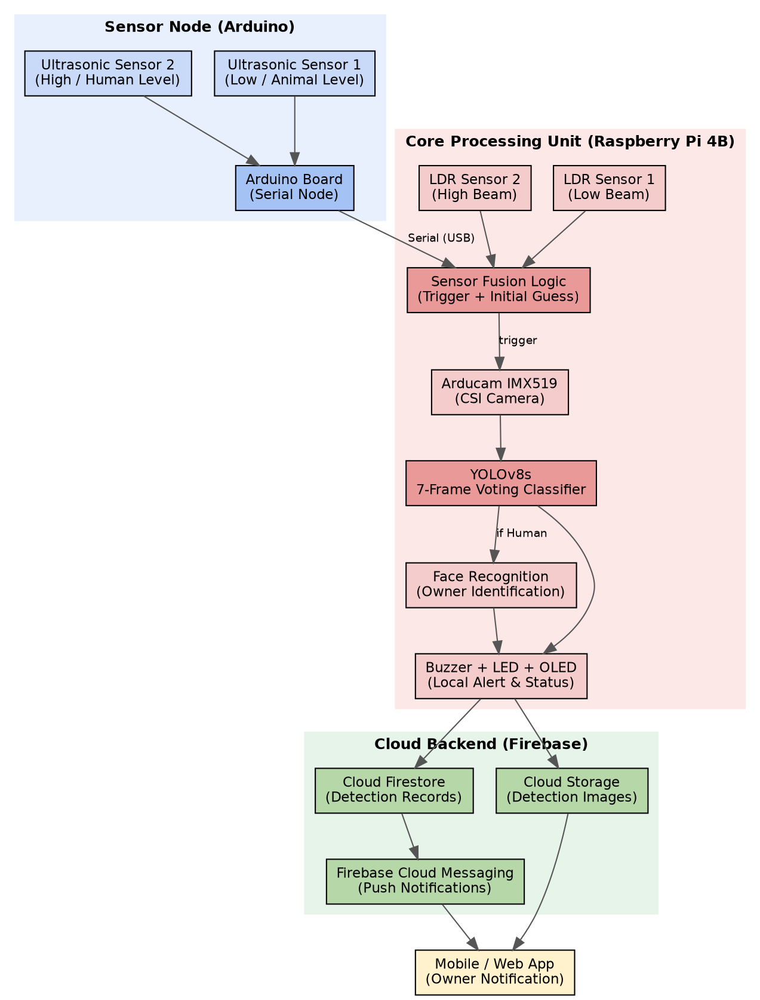
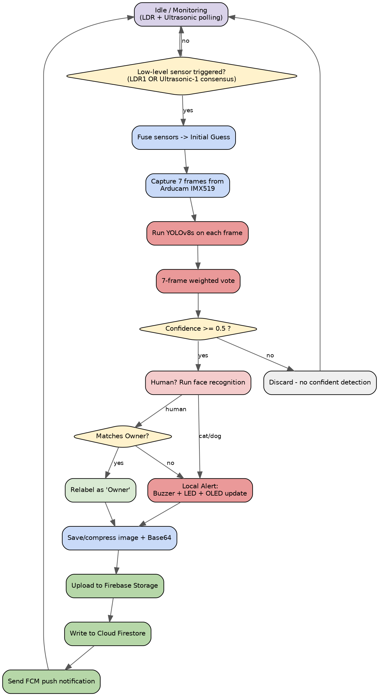
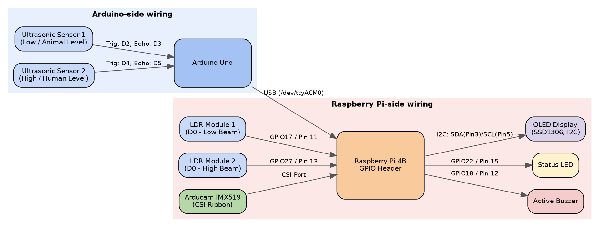
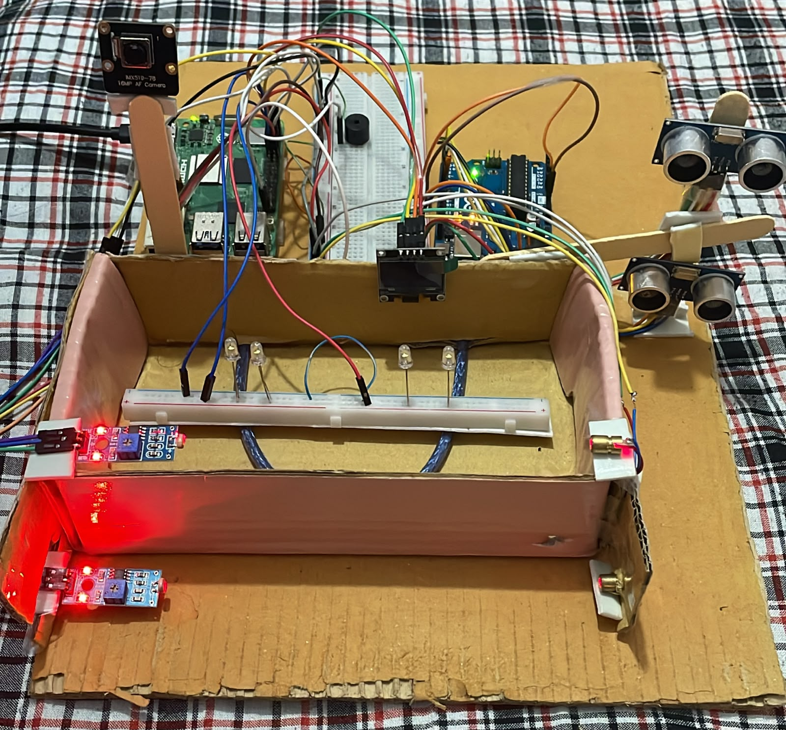

# Smart Fisheries Farm Intrusion Detection System

A dual-sensor, AI-assisted intrusion detection system for open fish enclosures and farm perimeters. It fuses ultrasonic and light-based proximity sensing with real-time YOLOv8 object detection and face recognition, then alerts the farm owner both on-site (buzzer, LED, OLED display) and remotely (Firebase push notification).


---

## Table of Contents

- [Project Description](#project-description)
- [Features](#features)
- [System Architecture](#system-architecture)
- [Detection Logic Flow](#detection-logic-flow)
- [Hardware Components](#hardware-components)
- [Wiring / GPIO Summary](#wiring--gpio-summary)
- [Software Components](#software-components)
- [Project Structure](#project-structure)
- [Setup Instructions](#setup-instructions)
- [Configuration](#configuration)
- [Running the System](#running-the-system)
- [Limitations](#limitations)
- [Future Work](#future-work)
- [Actual image](#actual-image)
- [Mobile App Repository](#mobile-app-repository)
- [Author](#author)

---

## Project Description

Traditional fencing and manual night patrols are labour-intensive and unreliable ways to protect fisheries farms from unauthorized human trespassers and predatory animals (cats, dogs). This project automates that job with a layered pipeline:

1. **Always-on proximity sensing** (LDR break-beams + Arduino-driven ultrasonic sensors) cheaply watches the perimeter.
2. Only when a crossing is genuinely detected does the system wake the **Arducam IMX519 camera** and run **YOLOv8s** object detection across a 7-frame burst, voting on the most likely class (Human / Cat / Dog).
3. If a person is detected, **face recognition** checks whether it's the registered farm owner, to avoid false intrusion alarms.
4. Confirmed intrusions raise an immediate **local alert** (buzzer + LED + OLED status display) and are logged to **Firebase** (Firestore + Storage), triggering a **push notification** to the owner's phone via FCM.

---

## Features

- **Dual-sensor fusion trigger** — LDR break-beam pairs and Arduino-driven ultrasonic sensors are combined so a detection height ("low/animal" or "high/human") is considered crossed if *either* sensing technology fires, improving reliability over a single sensor type.
- **Consensus-filtered ultrasonic readings** — a rolling history of the last 5 ultrasonic samples per sensor is kept; a crossing only counts once at least 3 of those samples fall below the 25 cm gate distance, rejecting single-sample noise (reflections, vibration).
- **Live camera preview window** — an OpenCV window streams the Arducam IMX519 feed with an overlaid HUD showing LDR state, live ultrasonic distances, and a clock.
- **7-frame YOLOv8s majority-vote classification** — once triggered, 7 consecutive frames are captured and classified; the final label is chosen using a combined votes × average-confidence score rather than trusting a single frame.
- **Owner face recognition** — a person classified as "Human" has their face compared against a registered owner encoding; a match relabels the detection as "Owner" so no intrusion alarm is raised.
- **On-site OLED status display** — a small I2C OLED panel shows the live monitoring state and the outcome of the most recent detection (class + confidence), giving an at-a-glance status without needing a phone or laptop nearby.
- **Classified buzzer + LED alert patterns** — 3 beeps for Human, 5 for Cat, 7 for Dog, with the LED flashing in sync.
- **Live Firestore profile listener** — the owner's face encoding is recomputed automatically in real time whenever a new profile photo is uploaded, with no restart required.
- **Cloud logging and alerting** — every confirmed detection is written to Cloud Firestore, its image uploaded to Firebase Storage (or embedded as Base64 on the free Spark plan), and an FCM push notification broadcast to a `farm_alerts` topic.
- **Graceful degradation** — if the Arduino is unplugged, or Firebase/Storage is unreachable, the affected subsystem retries automatically or falls back to local-only operation instead of crashing.

---

## System Architecture

The system is organised into three cooperating layers:

- **Sensor / edge layer** — Arduino + dual ultrasonic sensors, streaming distance readings to the Pi over USB serial.
- **Core processing layer** — Raspberry Pi 4B, running sensor fusion, camera capture, YOLOv8s inference, face recognition, and driving the buzzer/LED/OLED alert hardware.
- **Cloud layer** — Firebase (Firestore, Storage, Cloud Messaging), bridging the farm to the owner's mobile device.



> *Diagram generated for this documentation — replace with a photo of the physical build once assembled, if desired.*

---

## Detection Logic Flow

The system spends most of its time in a cheap, low-power idle/monitoring state, only escalating to camera capture and YOLO inference once the fused sensor trigger actually fires.



**Summary of the pipeline:**

1. Continuous low-level sensor polling and fusion (LDR + ultrasonic consensus).
2. A lightweight initial guess (Human vs. Animal) used only to decide whether to wake the camera.
3. A 7-frame camera burst, each frame classified independently by YOLOv8s.
4. A majority vote across those frames to reach a final, higher-confidence label.
5. An owner-disambiguation step for human detections via face recognition.
6. A dual-channel alert: an immediate local buzzer/LED/OLED cue on-site, plus a durable cloud record (image + metadata) delivered to the owner as a push notification via Firestore and FCM.

---

## Hardware Components

| Component | Model / Type | Interface | Role in the System |
|---|---|---|---|
| Central controller | Raspberry Pi 4B | — | Runs sensor fusion logic, YOLOv8s inference, face recognition, buzzer/LED/OLED control, and all Firebase communication. |
| Microcontroller (sensor node) | Arduino (Uno-class board, USB-serial) | USB → `/dev/ttyACM0` | Drives the two ultrasonic sensors and streams `US1:<cm>,US2:<cm>` readings to the Pi at ~10 Hz. |
| Ultrasonic distance sensor ×2 | HC-SR04-class ultrasonic ranging module | Digital I/O (Arduino) | US1: low/animal-level gate. US2: high/human-level gate. Feed the consensus-filtered fusion logic. |
| Light-Dependent Resistor module ×2 | LDR breakout module with digital (D0) output | GPIO17 (LDR1), GPIO27 (LDR2) | Break-beam style light sensors; LDR1 = low beam (animal level), LDR2 = high beam (human level). |
| Camera module | Arducam IMX519 (autofocus, CSI) | CSI ribbon (Picamera2) | Captures the 7-frame burst used for YOLOv8s classification and owner face recognition. |
| Buzzer | Active piezo buzzer | GPIO18 | Produces the classified beep pattern (3/5/7 beeps) for Human/Cat/Dog alerts. |
| Status LED | Standard LED (with current-limiting resistor) | GPIO22 | Flashes in sync with the buzzer as a visual alert indicator. |
| OLED display | 0.96" SSD1306-class I2C OLED (128×64) | I2C — SDA (GPIO2 / Pin 3), SCL (GPIO3 / Pin 5) | Shows live monitoring status and the most recent detection result on-site. |

---

## Wiring / GPIO Summary

The wiring splits into two sides: the **Arduino Uno**, which is wired directly to the two ultrasonic sensors, and the **Raspberry Pi**, which is wired to the LDRs, buzzer, LED, OLED, and camera, and talks to the Arduino only over USB serial.



### Arduino Uno ↔ Ultrasonic Sensors

| Sensor | Arduino Pins | Notes |
|---|---|---|
| Ultrasonic Sensor 1 (low / animal level) | Trig: D2, Echo: D3 | Wired directly to the Arduino Uno; readings are sent to the Pi as `US1:<cm>`. |
| Ultrasonic Sensor 2 (high / human level) | Trig: D4, Echo: D5 | Wired directly to the Arduino Uno; readings are sent to the Pi as `US2:<cm>`. |

> The Arduino pin numbers above (D2/D3, D4/D5) are the typical HC-SR04 Trig/Echo pairing — update these to match your actual `arduino/ultrasonic_node.ino` sketch if it wires the sensors differently.

### Raspberry Pi Wiring

| Signal | Raspberry Pi Pin | Notes |
|---|---|---|
| LDR1 D0 (low beam) | GPIO17 / Physical Pin 11 | Active-low with internal pull-up; "blocked" when pulled LOW. |
| LDR2 D0 (high beam) | GPIO27 / Physical Pin 13 | Active-low with internal pull-up; "blocked" when pulled LOW. |
| Buzzer + | GPIO18 / Physical Pin 12 | Driven HIGH for each beep pulse. |
| Status LED + | GPIO22 / Physical Pin 15 | Synchronised with the buzzer beep pattern. |
| OLED display (I2C) | SDA: GPIO2 / Pin 3, SCL: GPIO3 / Pin 5 | Standard Raspberry Pi I2C bus; also needs 3.3V and GND. |
| Arduino link | USB | Appears as `/dev/ttyACM0` or `/dev/ttyUSB0`; 9600 baud serial stream carrying both ultrasonic readings. |
| Camera | CSI Port | Arducam IMX519 connected via ribbon cable, driven through Picamera2. |

---

## Software Components

**Platform:** Raspberry Pi OS (Debian-based, 64-bit) on Raspberry Pi 4B, Python 3.

| Package | Purpose |
|---|---|
| `ultralytics` | Loads and runs the YOLOv8s (`yolov8s.pt`) object-detection model. |
| `opencv-python` (`cv2`) | Frame capture handling, image resizing/encoding, HUD drawing, live preview window. |
| `picamera2` | Interfaces with the Arducam IMX519 over the CSI port; continuous autofocus control. |
| `gpiozero` | High-level GPIO abstraction for the LDRs, buzzer, and LED. |
| `pyserial` | Reads the USB serial stream from the Arduino ultrasonic node. |
| `firebase-admin` | Server-side Firestore writes, Storage uploads, and FCM push notifications. |
| `face_recognition` | Computes and compares face encodings for owner identification (optional dependency). |
| Adafruit CircuitPython SSD1306 / `luma.oled` | Drives the I2C OLED display, rendering live monitoring status and detection results. |

---

## Project Structure

```

main.py                      # Core detection pipeline (sensor fusion, YOLO, Firebase)
├── arduino/
│   └── ultrasonic_node.ino      # Arduino sketch: dual ultrasonic streaming over serial
├── serviceAccountKey.json       # Firebase service account credentials (not committed)
├── detections_via_app/                  # Local fallback copies of captured detection images
├── images/                      # Architecture / wiring diagrams used in this README
└── README.md
```

---

## Setup Instructions

### 1. Prerequisites

- Raspberry Pi 4B running Raspberry Pi OS (64-bit)
- Arducam IMX519 connected via CSI ribbon
- Arduino (Uno-class board) connected via USB, running `arduino/ultrasonic_node.ino`
- LDR modules, buzzer, LED, and OLED wired per the [Wiring / GPIO Summary](#wiring--gpio-summary) above
- A Firebase project with Firestore enabled (Storage optional — Base64 fallback is used automatically if unavailable)

### 2. Install system dependencies

```bash
sudo apt update
sudo apt install -y python3-picamera2 --no-install-recommends
sudo raspi-config   # enable I2C (Interface Options -> I2C) for the OLED display
```

### 3. Install Python dependencies

```bash
pip install firebase-admin ultralytics opencv-python gpiozero pyserial
pip install face_recognition           # optional: enables owner disambiguation
pip install adafruit-circuitpython-ssd1306 adafruit-blinka   # OLED display driver
```

### 4. Firebase setup

1. Create a Firebase project and enable **Cloud Firestore**.
2. Generate a service account key (Project Settings → Service Accounts → Generate new private key) and save it as `serviceAccountKey.json` in the project root.
3. (Optional) Enable **Cloud Storage** if your billing plan supports it; otherwise the system automatically falls back to embedding a compressed Base64 image directly in each Firestore document.
4. Set up **Firebase Cloud Messaging** and subscribe your mobile app to the `farm_alerts` topic to receive push notifications.

### 5. Flash the Arduino

Upload `arduino/ultrasonic_node.ino` to the Arduino using the Arduino IDE. Confirm the Pi sees it:

```bash
ls /dev/tty*
# should show /dev/ttyACM0 or /dev/ttyUSB0
```

---

## Configuration

Key values to review at the top of `main.py` before running:

| Variable | Description |
|---|---|
| `SERVICE_ACCOUNT_KEY_PATH` | Path to your Firebase service account JSON. |
| `FIREBASE_STORAGE_BUCKET` | Your Firebase Storage bucket name. |
| `CAMERA_NAME`, `LOCATION` | Labels used in Firestore documents and push notifications. |
| `FRAMES_TO_CAPTURE`, `MIN_CONFIDENCE` | YOLO voting burst size and per-frame confidence threshold. |
| `SERIAL_PORT`, `SERIAL_BAUD` | Arduino serial connection settings. |
| `ULTRASONIC_GATE_CM` | Distance threshold (cm) for a sensor to count as triggered. |
| `US_HISTORY_LEN`, `US_CONSENSUS_REQUIRED` | Consensus-filtering window and vote threshold for ultrasonic noise rejection. |

---

## Running the System

```bash
python3 main.py
```

- A live camera preview window opens showing the HUD (LDR state, ultrasonic distances, timestamp).
- The OLED panel shows the current monitoring status and the most recent detection result.
- Press **Q** in the camera window to quit.

---

## Limitations

- Ultrasonic and LDR sensors are short-range and line-of-sight dependent; dense vegetation, fog, or heavy rain can degrade both sensing modalities simultaneously.
- YOLOv8s classification is limited to Human, Cat, and Dog; other animals that threaten fisheries (otters, snakes, birds) are not currently classified.
- Face recognition accuracy depends on crop quality, lighting, and angle at capture time.
- Only a single owner face encoding is supported at a time — multiple authorized people cannot yet be distinguished individually.
- Firebase Cloud Storage image upload is unavailable on the free-tier (Spark) plan; the Base64 fallback keeps a smaller, lower-quality image.
- The Arduino-to-Pi link is a single USB serial connection; if it drops, the system temporarily falls back to LDR-only sensing until it reconnects.
- Continuous YOLOv8s inference on a Raspberry Pi 4B (without a hardware accelerator) introduces a short delay between the initial sensor trigger and the final classified alert.

---

## Future Work

- Multi-owner face recognition support.
- Additional trained classes for other fisheries predators (otters, birds, snakes).
- Infrared/night-vision imaging path for low-light conditions.
- Hardware acceleration (e.g. Coral TPU / Hailo module) to reduce YOLO inference latency.

---

## Actual Image 
Actual image of the project with hardware components



---

## Mobile App Repository
The mobile app was built using Flutter for making the overall project more suitable for real world application

The repository link for the mobile app- [Please Click Here](https://github.com/Progga-Paromita/Detect_pet_unauthorized_person_with_image_processing_mobile_interface_for_owner)

---

## Author

**Zaina Rahman, Roll- 2207021**
Department of Computer Science & Engineering, Khulna University of Engineering & Technology (KUET)

**Progga Paromita, Roll- 2207030**
Department of Computer Science & Engineering, Khulna University of Engineering & Technology (KUET)

